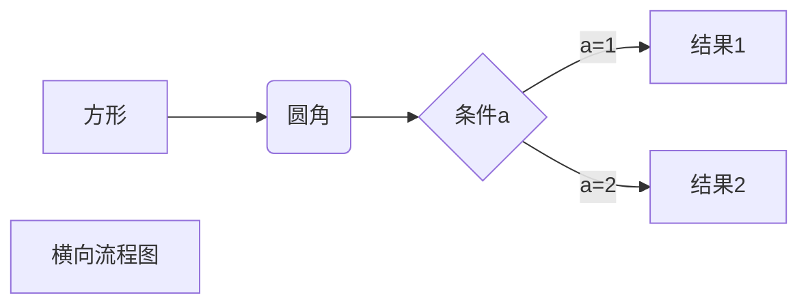
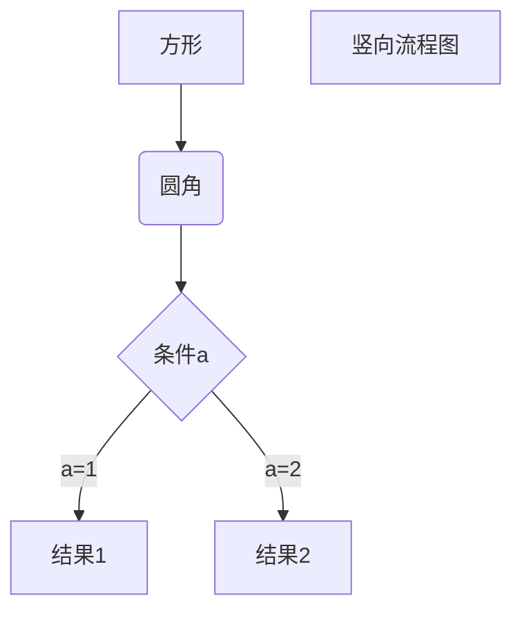
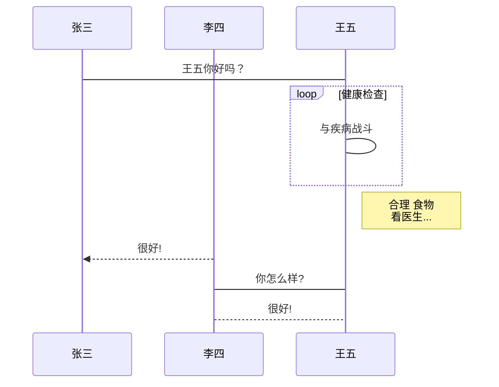
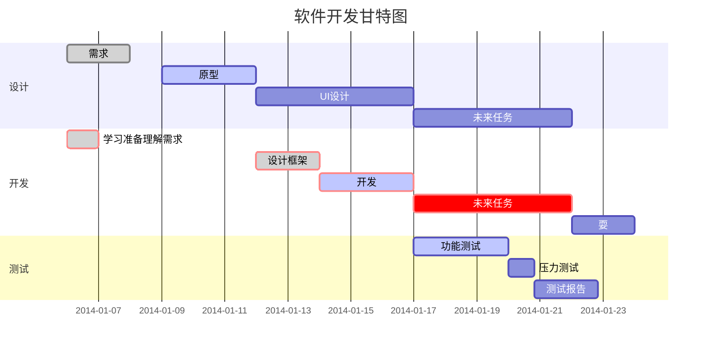

# 1. Markdown 教程
## 1.1. Markdown 简介
Markdown 是一种轻量级标记语言，它允许人们使用易读易写的纯文本格式编写文档。它在 2004 由约翰·格鲁伯（英语：John Gruber）创建。相对于较为复杂的HTML，Markdown的学习成本非常低。它可以让你专注于文档写作，而不被繁复的格式所困扰。此外，Markdown 编写的文档可以导出 HTML 、Word、图像、PDF、Epub 等多种格式的文档，适合在不同平同间使用。Markdown 编写的文档后缀为 `.md`, `.markdown`。

## 1.2. Markdown 应用
Markdown 能被使用来撰写电子书，如：Gitbook。

当前许多网站都广泛使用 Markdown 来撰写帮助文档或是用于论坛上发表消息。例如：GitHub、CSDN、知乎、简书、reddit、Diaspora、Stack Exchange、OpenStreetMap 、SourceForge等。

## 1.3. 编辑器

### 1.3.1 Typora

Typora支持支持 MacOS 、Windows、Linux 平台，且包含多种主题，编辑后直接渲染出效果。它支持导出HTML、PDF、Word、图片等多种类型文件。

Typora 官网：<http://typora.io/>

### 1.3.2 Visual Studio Code

Visual Studio Code （简称VS Code）是一款由微软开发且跨平台的免费源代码编辑器。它配合Markdown相关的插件即可用作 Markdown 编辑器。

Visual Studio Code [下载地址](https://code.visualstudio.com/)

推荐的Markdown插件：  

1. Markdown All in One  
     
   包括了Markdown编辑器的大部分功能，包括自动补齐、快捷键、预览等。
2. Markdown Preview Enhanced 
   
   增强了预览功能。

## 1.3. 实例

```
Hello world!
```

效果如下：  
Hello world!

# 2. Markdown 标题
Markdown 标题有两种格式。
## 2.1. 使用 = 和 - 标记一级和二级标题

`-`和`=`的标题语法如下

```
一级标题
=========
二级标题
--------
```

## 2.2. 使用 # 号标记

`#`的标题语法如下

```
# 一级标题
## 二级标题  
### 三级标题  
#### 四级标题  
##### 五级标题  
###### 六级标题
```

# 3. Markdown 段落格式
## 3.1. 换行与段落
段落的换行是在句末加两个空格，再加一个回车。

在段落后面使用一个空行来表示重新开始一个段落。

## 3.2. 字体
Markdown 可以使用以下几种字体：
```
*斜体文本*  
_斜体文本_  
**粗体文本**  
__粗体文本__  
***粗斜体文本***  
___粗斜体文本___  
```
效果如下所示：

*斜体文本*  
_斜体文本_  
**粗体文本**  
__粗体文本__  
***粗斜体文本***  
___粗斜体文本___  

## 3.3. 文字排版

### 3.3.1. 文字居中

```
<center>居中</center>
```

效果如下所示：

<center>居中</center>

### 3.3.2. 左对齐

```
<p align="left">左对齐</p>
```

效果如下所示：

<p align="left">左对齐</p>

### 3.3.3. 右对齐

```
<p align="right">右对齐</p>
```

效果如下所示：

<p align="right">右对齐</p>

## 3.4. 分隔线

你可以在一行中用三个以上的星号、减号、下划线来建立一个分隔线，行内不能有其他东西。你也可以在符号中间插入空格。下面每种写法都可以建立分隔线：  

```
******
* * *
----------
- - -
______
_ _ _ _ _ _
```

效果如下所示：

******
* * *
----------
- - -
______
_ _ _ _ _ _

## 3.5. 删除线
如果段落上的文字要添加删除线，只需要在文字的两端加上两个波浪线 `~~` 即可：

```
~~这样就可以删除了~~
```

效果如下所示：

~~这样就可以删除了~~

## 3.6. 下划线
下划线可以通过 HTML 的 `<u>` 标签来实现：

```
<u>带下划线文本</u>
```

效果如下所示：

<u>带下划线文本</u>

## 3.7. 脚注
脚注是对文本的补充说明。Markdown 脚注的格式如下:
```
创建脚注格式类似这样 [^脚注]
[^脚注]:脚注会被自动移到段落末尾。
```

效果如下所示：

创建脚注格式类似这样 [^脚注]

[^脚注]:脚注会被自动移到段落末尾。

## 3.8. 目录
在文件的最开头输入`[toc]`即可插入目录。

# 4. Markdown 列表
Markdown 支持有序列表和无序列表。

## 4.1. 无序列表
无序列表使用星号(`*`)、加号(`+`)或是减号(`-`)作为列表标记，这些标记后面要添加一个空格，然后再填写内容：

```
* 第一项
* 第二项
* 第三项

+ 第一项
+ 第二项
+ 第三项

- 第一项
- 第二项
- 第三项
```

效果如下：  
* 第一项
* 第二项
* 第三项

+ 第一项
+ 第二项
+ 第三项

- 第一项
- 第二项
- 第三项

## 4.2. 有序列表
```
1. 第一项
2. 第二项
3. 第三项
```
1. 第一项
2. 第二项
3. 第三项

## 4.3. 列表嵌套
列表嵌套只需在子列表中的选项前面添加四个空格即可：
```
1. 第一项：
    - 第一项嵌套的第一个元素
    - 第一项嵌套的第二个元素
2. 第二项：
    - 第二项嵌套的第一个元素
    - 第二项嵌套的第二个元素
```
1. 第一项：
    - 第一项嵌套的第一个元素
    - 第一项嵌套的第二个元素
2. 第二项：
    - 第二项嵌套的第一个元素
    - 第二项嵌套的第二个元素

# 5. Markdown 区块
Markdown 区块引用是在段落开头使用 `>` 符号，然后后面紧跟一个空格符号：
```
> 区块引用
> 引用内容
> Markdown教程
```
> 区块引用
> 引用内容
> Markdown教程

## 5.1. 嵌套区块
另外区块是可以嵌套的，一个 `>` 符号是最外层，两个 `>` 符号是第一层嵌套，以此类推：
```
> 最外层
> > 第一层嵌套
> >
> > > 第二层嵌套
```
> 最外层
> > 第一层嵌套
> >
> > > 第二层嵌套

## 5.2. 区块中使用列表
区块中使用列表实例如下：
```
> 区块中使用列表
> 1. 第一项
> 2. 第二项
> + 第一项
> + 第二项
> + 第三项
```
> 区块中使用列表
> 1. 第一项
> 2. 第二项
> + 第一项
> + 第二项
> + 第三项

## 5.3. 列表中使用区块
如果要在列表项目内放进区块，那么就需要在 > 前添加四个空格的缩进。列表中使用区块实例如下：
```
* 第一项
    > 引用内容
    > 引用内容
* 第二项
```
* 第一项
    > 引用内容
    > 引用内容
* 第二项

# 6. Markdown 代码
## 6.1. 代码片段
如果是段落上的一个函数或片段的代码可以用反引号把它包起来（`），例如：

```
`printf()` 函数
```

`printf()` 函数

## 6.2. 代码区块
你可以用 \`\`\` 包裹一段代码，并指定一种语言（也可以不指定）：
```
​```javascript
$(document).ready(function () {
    alert('Markdown');
});
​```
```

# 7. Markdown 链接
## 7.1. 链接使用方法
链接使用方法如下：
```
这是一个链接 [谷歌](www.google.com)
或者
<www.google.com>
```
效果如下：  
这是一个链接 [谷歌](www.google.com)
或者
<www.google.com>

## 7.2. 高级链接
```
这个链接用 1 作为网址变量 [Google][1]
这个链接用 Google 作为网址变量 [Google][Google]
然后在文档的结尾为变量赋值（网址）

[1]: http://www.google.com/
[Google]: http://www.google.com/
```
效果如下：  
这个链接用 1 作为网址变量 [Google][1]
这个链接用 Google 作为网址变量 [Google][Google]
然后在文档的结尾为变量赋值（网址）

[1]: http://www.google.com/
[Google]: http://www.google.com/

# 8. Markdown 图片
Markdown 图片语法格式如下：


实例如下：  
```


```
效果如下：  


# 9. Markdown 表格
Markdown 制作表格使用 `|` 来分隔不同的单元格，使用 `-` 来分隔表头和其他行。
实例如下：  
```
|  表头   | 表头  |
|  ----  | ----  |
| 单元格  | 单元格 |
| 单元格  | 单元格 |
```
效果如下：  
|  表头   | 表头  |
|  ----  | ----  |
| 单元格  | 单元格 |
| 单元格  | 单元格 |

## 9.1. 对齐方式
`-:` 设置内容和标题栏居右对齐。  
`:-` 设置内容和标题栏居左对齐。  
`:-:` 设置内容和标题栏居中对齐。

实例如下：
```
| 左对齐 | 右对齐 | 居中对齐 |
| :-----| ----: | :----: |
| 单元格 | 单元格 | 单元格 |
| 单元格 | 单元格 | 单元格 |
```

效果如下：
| 左对齐 | 右对齐 | 居中对齐 |
| :-----| ----: | :----: |
| 单元格 | 单元格 | 单元格 |
| 单元格 | 单元格 | 单元格 |

# 10. Markdown 高级技巧
## 10.1. 支持的 HTML 元素
不在 Markdown 涵盖范围之内的标签，都可以直接在文档里面用 HTML 撰写。

目前支持的 HTML 元素有：`<kbd>` `<b>` `<i>` `<em>` `<sup>` `<sub>` `<br>` 等 ，如：
```
使用 <kbd>Ctrl</kbd>+<kbd>Alt</kbd>+<kbd>Del</kbd> 重启电脑
```
使用 <kbd>Ctrl</kbd>+<kbd>Alt</kbd>+<kbd>Del</kbd> 重启电脑

## 10.2. 转义
Markdown 使用了很多特殊符号来表示特定的意义，如果需要显示特定的符号则需要使用转义字符，Markdown 使用反斜杠转义特殊字符：
```
**文本加粗** 
\*\* 正常显示星号 \*\*
```
**文本加粗** 
\*\* 正常显示星号 \*\*

Markdown 支持以下这些符号前面加上反斜杠来帮助插入普通的符号：
\\   反斜线
\`   反引号
\*   星号
\_   下划线
\{\}  花括号
\[\]  方括号
\(\)  小括号
\#   井字号
\+   加号
\-   减号
\.   英文句点
\!   感叹号

## 10.3. 公式
当你需要在编辑器中插入数学公式时，可以使用两个美元符 $$ 包裹 TeX 或 LaTeX 格式的数学公式来实现。如：
```
$$
\mathbf{V}_1 \times \mathbf{V}_2 =  \begin{vmatrix} 
\mathbf{i} & \mathbf{j} & \mathbf{k} \\
\frac{\partial X}{\partial u} &  \frac{\partial Y}{\partial u} & 0 \\
\frac{\partial X}{\partial v} &  \frac{\partial Y}{\partial v} & 0 \\
\end{vmatrix}
$$
```
$$
\mathbf{V}_1 \times \mathbf{V}_2 =  \begin{vmatrix} 
\mathbf{i} & \mathbf{j} & \mathbf{k} \\
\frac{\partial X}{\partial u} &  \frac{\partial Y}{\partial u} & 0 \\
\frac{\partial X}{\partial v} &  \frac{\partial Y}{\partial v} & 0 \\
\end{vmatrix}
$$
LaTeX数学公式语法参考：  
1. <https://www.cn.blogs.com/1024th/p/11623258.html>
2. <https://www.overleaf.com/learn/latex/Mathematical_expressions>

## 10.4. 画流程图、时序图、甘特图

mermaid

关键字graph表示一个流程图的开始，同时需要指定该图的方向

**图方向**

- TB，从上到下
- TD，从上到下
- BT，从下到上
- RL，从右到左
- LR，从左到右

### 10.4.1. 横向流程图


### 10.4.2. 竖向流程图


### 10.4.3. 标准流程图
```flow
st=>start: 开始框
op=>operation: 处理框
cond=>condition: 判断框(是或否?)
sub1=>subroutine: 子流程
io=>inputoutput: 输入输出框
e=>end: 结束框
st->op->cond
cond(yes)->io->e
cond(no)->sub1(right)->op
```

### 10.4.4. 标准流程图（横向）
```flow
st=>start: 开始框
op=>operation: 处理框
cond=>condition: 判断框(是或否?)
sub1=>subroutine: 子流程
io=>inputoutput: 输入输出框
e=>end: 结束框
st(right)->op(right)->cond
cond(yes)->io(bottom)->e
cond(no)->sub1(right)->op
```

### 10.4.5. UML时序图
```sequence
对象A->对象B: 对象B你好吗?（请求）
Note right of 对象B: 对象B的描述
Note left of 对象A: 对象A的描述(提示)
对象B-->对象A: 我很好(响应)
对象A->对象B: 你真的好吗？
```

### 10.4.6. UML时序图复杂样例
```sequence
Title: 标题：复杂使用
对象A->对象B: 对象B你好吗?（请求）
Note right of 对象B: 对象B的描述
Note left of 对象A: 对象A的描述(提示)
对象B-->对象A: 我很好(响应)
对象B->小三: 你好吗
小三-->>对象A: 对象B找我了
对象A->对象B: 你真的好吗？
Note over 小三,对象B: 我们是朋友
participant C
Note right of C: 没人陪我玩
```

### 10.4.7. UML标准时序图


### 10.4.8. 甘特图样例

